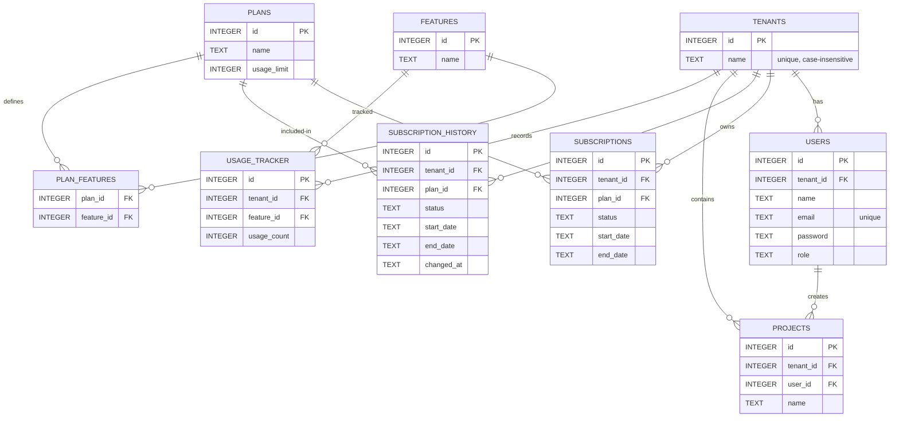

# CloudFlow Diagrams and Database Design

This file contains the ER diagram, database design notes, and architecture diagram
in Mermaid format; you can copy-paste these into your slides or documentation.

---

## ER Diagram (Mermaid)



---

## Database Design Notes

* `tenants.name` has a UNIQUE index with `COLLATE NOCASE` so that "Port" and
  "port" map to the same company.  `createTenant()` returns the existing ID when
  a name already exists, allowing new users to join the same tenant.
* `users.email` is globally unique; each user belongs to zero or one tenant
  (`tenant_id` nullable for superadmins).
* `subscriptions` track the current active plan per tenant.  A trigger or the
  application logic records each change in `subscription_history` for audit.
* `usage_tracker` rows are updated atomically using `ON CONFLICT DO UPDATE` to
  avoid race conditions when multiple requests increment the same counter.
* Role field in `users` supports `user`, `admin`, and `superadmin` values.

---

## Architecture Diagram (Mermaid)

```mermaid
graph LR
    subgraph Frontend
        React[React SPA]
        React -->|API calls| APIClient[API Client (axios)]
    end

    subgraph Backend
        Express[Express.js Server]
        AuthMiddleware[authMiddleware]
        EntitlementMiddleware[subscription/entitlement checks]
        UsageMiddleware[usageMiddleware]
        Controllers[Controllers]
        Models[Model Layer]
        SQLite[SQLite DB]
    end

    APIClient --> Express
    Express --> AuthMiddleware
    AuthMiddleware --> EntitlementMiddleware
    EntitlementMiddleware --> UsageMiddleware
    UsageMiddleware --> Controllers
    Controllers --> Models
    Models --> SQLite

    subgraph API Endpoints
        Auth[/api/auth/*]
        Projects[/api/projects/*]
        Subscriptions[/api/subscriptions/*]
        Admin[/api/admin/*]
    end

    Express --> Auth
    Express --> Projects
    Express --> Subscriptions
    Express --> Admin
```

---

Copy the above Mermaid blocks into any Markdown or Mermaid editor to render the
diagrams visually.  The architecture graph highlights middleware order and API
namespaces, while the ER diagram shows table relationships.
